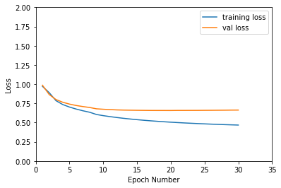
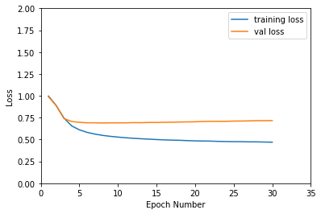
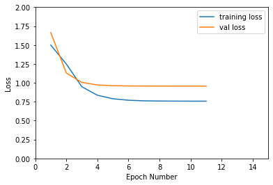
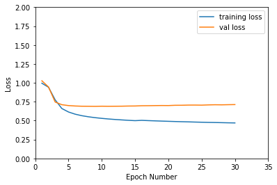
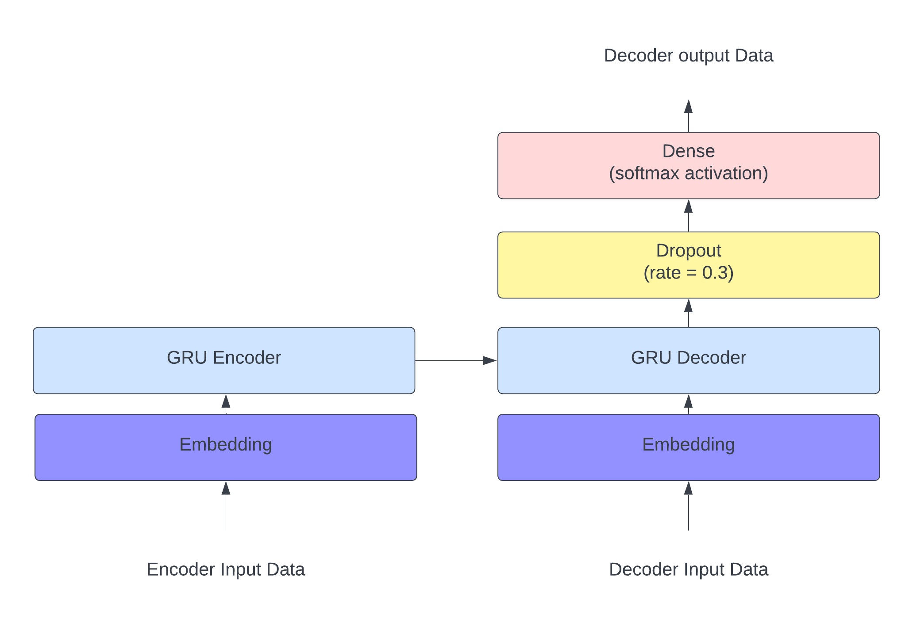
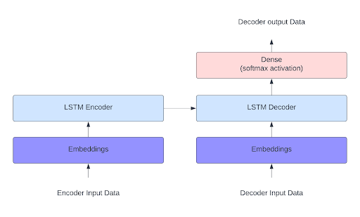
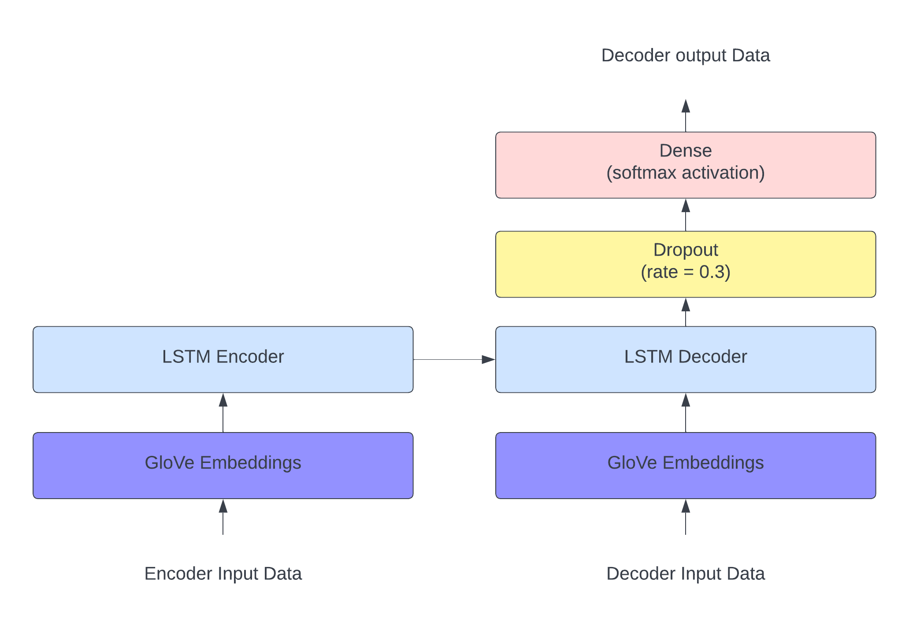
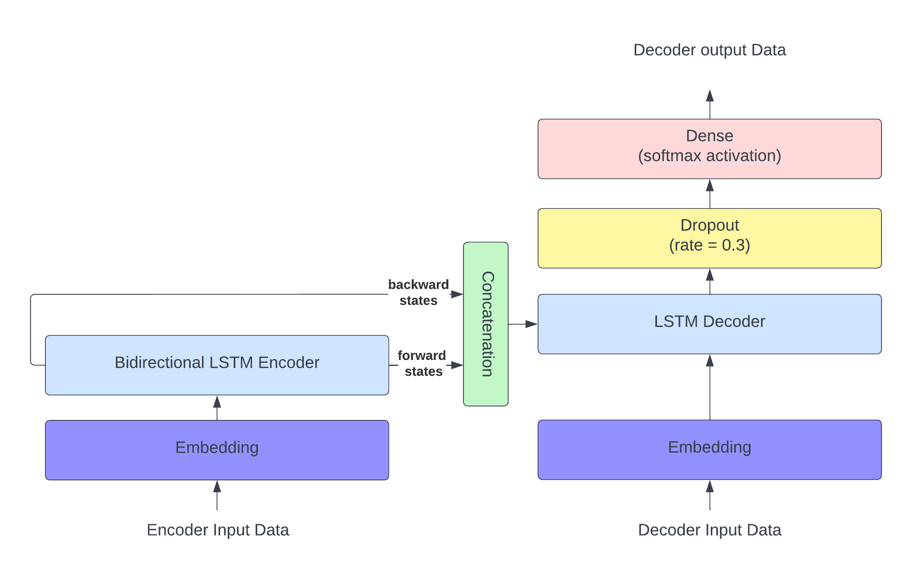
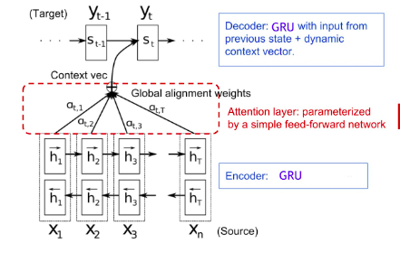
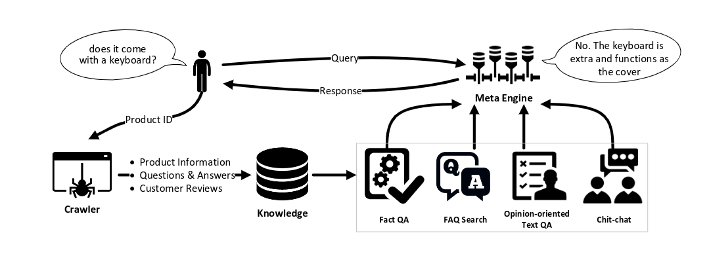

## Problem Statement

A chatbot is an NLP model that learns from data based on human-to-human dialogue. Our model will be trained and tested on a QA dataset to imitate human's ability to answer questions. The chatbot model is a generative model as it doesn’t use a predefined repository for answering questions and generates answers word by word. 

## Datasets

### Amazon Data [link](http://jmcauley.ucsd.edu/data/amazon/qa/)

* 1.4 million answered questions of different categories.
* Around 20, 000 examples from each of the three categories :

  1 - Health and Personal Care   	(total examples ≃   80000)          
  2 - Sports and Outdoors             	(total examples ≃   145000)    
  3 - Clothing, Shoes, and Jewelry 	(total examples ≃   22000)

### Chatbot Training Dataset [link](https://www.kaggle.com/datasets/saurabhprajapat/chatbot-training-dataset?resource=download)

* Human talking to a robot.
* Around 500 examples.

### Personality Chat Datasets[ link](https://github.com/microsoft/botframework-cli/blob/main/packages/qnamaker/docs/chit-chat-dataset.md)

* These datasets have been specifically curated to work with QnA Maker.
* Contain chitchats with a chatbot
* Around 50000 examples.

## Data Preprocessing and Cleaning

* Removing Punctuation   
* Decontracting Phrases       
* Lowercasing The Letters and Adding START and END to The Answers
* Train-test Splitting & Shuffling (90% Train, 5% Test, 5% Validation)

## Data Tokenization 

1. We use Keras’ Tokenizer( ) to get the vocabulary

2. Each word in the vocabulary is assigned a number 

3. We convert each text to a sequence of numbers

4. To make all the examples equal, we get the max question length and max answer length and add padding

## Model Architectures : Seq2Seq Models

### **GRU Encoder Decoder Model**

**Hyperparameter Tuning**

Before training our models, hyperparameter tuning is performed on the GRU encoder-decoder model, since it’s the fastest to train.  Best results are applied to the remaining models.

#### **Optimizers** 

1. RMSprop

        Training Loss: 0.5833				Training Accuracy: 33.52 %

        Validation Loss: 0.6715			Validation Accuracy: 29.98%

2. Adam

        Training Loss: 0.4678				Training Accuracy: 38.72 %

        Validation Loss: 0.6629			Validation Accuracy: 31.39%

    **Other parameters:**

    	Number of Epochs: 30

        Learning Rate: 0.001

        Loss Function: SparseCategoricalCrossentropy

        Embeddings size = 50

        Number of Memory Units = 100

    **Conclusion** : Adam optimizer gave better results than RMS prop.

#### **Learning Rates**

1. Lr = 0.001 

        Training Loss: 0.4678 		Training Accuracy: 38.72 %

        Validation Loss: 0.6629		Validation Accuracy: 31.39 %

2. Lr = 0.01 

        Training Loss: 0.4696 			Training Accuracy: 36.71 %

        Validation Loss: 0.7172 			Validation Accuracy: 29.99%

         

3. Exponential learning rate decay (lr = 0.1 , decay_steps = 1000, decay_rate = 0.3) 

        Training Loss: 0.7572 		Training Accuracy: 16.84  %

        Validation Loss: 0.9569 		Validation Accuracy: 15.87%

            

4. Exponential learning rate decay (lr = 0.01, decay_steps = 10000, decay_rate = 0.9) 

        Training Loss: 0.4695			Training Accuracy: 36.84%

        Validation Loss: 0.7123			Validation Accuracy: 30.13%

    **Other parameters:**

        Optimizer: Adam

        Loss Function: SparseCategoricalCrossentropy

        Embeddings size = 50

        Number of Memory Units = 100

**Conclusion** : Both options 2 and 4 achieved similar results, which are the best among all results.

#### **Memory Units**

1. Units = 60 \
Validation Accuracy =  24% \

2. Units = 100 \
Validation Accuracy = 26.9% \

3. Units = 150 \
Validation Accuracy = 27.8% \

4. Units = 200 \
Validation Accuracy = 27.7% \

    **Other parameters:**

    	Epochs: 30

        Optimizer: Adam 

        Learning rate: 0.01

        Loss function: SparseCategoricalCrossentropy

        Metrics: accuracy

        Embeddings size = 50

    **Conclusion** : 150 memory units give the best results for the model.

#### **Embedding Size**

1. Embedding Size = 100

    Validation Accuracy =  0.316

2. Embedding Size = 200

    Validation Accuracy = 0.3156

3. Embedding Size = 300

    Validation Accuracy = 0.337

    **Other parameters:**

    	Epochs: 30

        Optimizer: Adam 

        Learning rate: 0.01

        Loss function: SparseCategoricalCrossentropy

        Metrics: accuracy 

        Number of Memory Units = 100

    **Conclusion** : Embedding size of 300 gives the best results for the model.

**Model Architecture and Results**

#### **Model Settings**

    Total number of data samples: 60500 (Amazon Data + Chatbot Training Dataset)

    Training set ratio: 90%

    Dev set ratio: 5%

    Test set ratio: 5%

    Optimizer: Adam with exponential learning rate decay
                (lr = 0.01 , decay_steps = 10000, decay_rate = 0.9)

    Loss Function: SparseCategoricalCrossentropy

    Dropout rate = 0.3

    Embeddings size = 300

    Number of Memory Units = 150

#### **Model Architecture**

#### **Results**

    Training Loss: 0.5968				Training Accuracy: 25.49%

    Validation Loss: 0.7063			Validation Accuracy: 25.98%

    Test Loss: 0.7263				Test Accuracy: 25.82 %

#### **Inference Examples**

**Example 1**

**Question:** how are you

**Answer:** i have not tried it for a year and it is a little big but i have used it for a year and i have used it for a year and i have used it for a year and i have used it for a year and …

**Bleu Score:** 0.001

**Reference Sentences:** i am fine - i am good - fine - good

**Comments:** the model couldn’t generate the end token and stopped when it reached the maximum answer length.

**__**   

**Example 2**

**Question:** what is the size of this jacket

**Answer:** i am 5 7 5 8 and the size is a bit big for me i am not sure the size is a size chart i am not sure what i would say that i would say that is a size chart i am not sure what i would say that i would say that is a size chart i am not sure what i would say that i would say that …

**Bleu Score:** 0.006

**Reference Sentences:** it is xxl - it is 46 - it is small

**Comments:** the model couldn’t generate the end token and stopped when it reached the maximum answer length.

**__**   

**Example 3**

**Question:** what are the best steps for a daily skincare routine

**Answer:** yes it is a good product

**Bleu Score:** 0.029

**Reference Sentences:** you can start with cleaning the skin then scrubbing and finally Moisturizing - the most important steps are scrubbing and Moisturizing

**Comments:** the answer is slightly relevant to the question, but still not a good one.

**__**   

**Example 4**

**Question:** is potato good for kids

**Answer:** yes it is a great deal

**Bleu Score:** 0.492

**Reference Sentences:** yes it is good for kids - yes - yes it is full of fibre and protein - yes it is full of nutrients

**Comments:** the model could recognize that it’s a yes/no question.

### **LSTM Encoder Decoder Model**

#### **Model Settings**

    Total number of data samples: 60500 (Amazon Data + Chatbot Training Dataset)

    Training set ratio: 90%

    Dev set ratio: 5%

    Test set ratio: 5%

    Optimizer: Adam (lr = 0.01)

    Loss Function: SparseCategoricalCrossentropy

    Embeddings size = 200

    Number of Memory Units = 200

#### **Model Architecture**

#### **Results**

    Validation Loss: 0.6		Validation Accuracy: 38%

    Test Loss: 0.62		Test Accuracy: 38%

#### **Inference Examples**

**Example 1**

**Question:** how are you

**Answer:** i am not sure i have used it for my wife is and he loves it

**Bleu Score:** 0.076

**Reference Sentences:** i am fine - i am good - fine - good

**Comments:** the model can’t answer questions from Chatbot Training Dataset due to lack of examples from this dataset during training.

**__**   

**Example 2**

**Question:** what is the size of this jacket

**Answer:** 34

**Bleu Score:** 0.016

**Reference Sentences:** it is xxl - it is 34 - it is small

**Comments:** the model gave a good but short answer with respect to references. Also since the answer is a number or a clothes size, the references can’t cover all cases.

**__**   

**Example 3**

**Question:** what are the best steps for a daily skincare routine

**Answer:** the large size is a great product

**Bleu Score:** 0.12

**Reference Sentences:** you can start with cleaning the skin then scrubbing and finally Moisturizing - the most important steps are scrubbing and Moisturizing

**Comments:** the model seems to be confused with categories and generates irrelevant answers.

**__**   

**Example 4**

**Question:** is potato good for kids

**Answer:** yes

**Bleu Score:** 0.56

**Reference Sentences:** yes it is good for kids - yes - yes it is full of fibre and protein - yes it is full of nutrients

**Comments:** the model could recognize that it’s a yes/no question and gave a valid answer.

### **LSTM Encoder Decoder Model + GloVe Embedding**

#### **Model Settings**

    Total number of data samples: 60500 (Amazon Data + Chatbot Training Dataset)

    Training set ratio: 90%

    Dev set ratio: 5%

    Test set ratio: 5%

    Optimizer: Adam (lr = 0.01)

    Loss Function: SparseCategoricalCrossentropy

    Dropout rate = 0.3

    Number of Memory Units = 150

#### **Model Architecture**

#### **Results**

    Training Loss: 0.6109		Training Accuracy: 89%

    Validation Loss: 0.69		Validation Accuracy: 88%

    Testing Loss: 0.7		Validation Accuracy: 88%

#### **Inference Examples**

**Example 1**

**Question:** how are you

**Answer:** aloha ref the label on the back of the product

**Bleu Score:** 0.0123

**Reference Sentences:** i am fine - i am good - fine - good

**__**   

**Example 2**

**Question:** what is the size of this jacket

**Answer:** go with xl

**Bleu Score:** 0.124

**Reference Sentences:** it is xl - it is 34 - it is small

**Comments:** the model recognized the word “size” and gave a good relevant answer, although the bleu score is low.

**__**   

**Example 3**

**Question:** what are the best steps for a daily skincare routine

**Answer:** not sure of the product

**Bleu Score:** 0.078

**Reference Sentences:** you can start with cleaning the skin then scrubbing and finally Moisturizing - the most important steps are scrubbing and Moisturizing

**__**   

**Example 4**

**Question:** what is your name

**Answer:** go to the size chart recommends i have a large and generous is a little big for me

**Bleu Score:** 0.14

**Reference Sentences:** robot - i am chatbot - chatbot -  i do not have a name

**Comments:** the model can’t answer questions from Chatbot Training Dataset due to lack of examples from this dataset during training.

### **Bidirectional LSTM Encoder Decoder Model**

#### **Model Settings**

    Total number of data samples: 60500 (Amazon Data + Chatbot Training Dataset)

    Training set ratio: 90%

    Dev set ratio: 5%

    Test set ratio: 5%

    Optimizer: Adam (lr = 0.01)

    Loss Function: SparseCategoricalCrossentropy

    Dropout rate = 0.3

    Embeddings size = 200

    Number of Memory Units = 150

#### **Model Architecture**

#### **Results**

    Training Loss: 0.56		Validation Accuracy: 31%

    Validation Loss: 0.6		Validation Accuracy: 31%

#### **Inference Examples**

**Example 1**

**Question:** how are you

**Answer:** i do not know if you are asking about the same size

**Bleu Score:** 0.017

**Reference Sentences:** i am fine - i am good - fine - good

**Comments:** the model can’t answer questions from Chatbot Training Dataset due to lack of examples from this dataset during training.

**__**   

**Example 2**

**Question:** what is the size of this jacket

**Answer:** i have a size chart for the first time i am 5 7 and it is a little big for me

**Bleu Score:** 0.07

**Reference Sentences:** it is xxl - it is 46 - it is small

**Comments:** the model recognized the word “size” and gave a relevant answer but of poor quality.

**__**   

**Example 3**

**Question:** what are the best steps for a daily skincare routine

**Answer:** i have a small amount of room for a year and i am 5 7 and i am a size 8 and it is a little big for me

**Bleu Score:** 0.127

**Reference Sentences:** you can start with cleaning the skin then scrubbing and finally Moisturizing - the most important steps are scrubbing and Moisturizing

**Comments:** the model seems to be confused with categories and generates irrelevant answers.

**__**   

**Example 4**

**Question:** is potato good for kids

**Answer:** i would not recommend it

**Bleu Score:** 0.112

**Reference Sentences:** yes it is good for kids - yes - yes it is full of fibre and protein - yes it is full of nutrients

**Comments:** although the answer is valid, the value of bleu score is very low.

### **Attention Model**

#### **Model Settings**

    Total number of data samples: 60500 (Amazon Data + Chatbot Training Dataset)

    Training set ratio: 90%

    Dev set ratio: 5%

    Test set ratio: 5%

    Optimizer: Adam

    Loss Function: SparseCategoricalCrossentropy

    Embeddings size = 300

    Number of Memory Units = 150

    Number of epochs: 82

#### **Model Architecture**

#### **Results**

    Training Loss:  0.3227 (due to different architecture of the attention model we could only obtain training loss)

**Inference Examples**

**Example 1**

**Question:** how are you

**Answer:** i have had no trouble with a lot of a retired from the money

**Bleu score:** 0.01479

**Reference Sentences:** i am fine - i am good - fine - good

**Comments:** answer is completely irrelevant.

**__**   

**Example 2**

**Question:** what is the size of this jacket

**Answer:** 34 38 xx large

**Bleu score:** 0.054

**Reference Sentences:** it is xxl - it is 34 - it is small

**Comments:** the model recognized the word size and gave a relevant answer, but with wrong sentence structure.

**__**   

**Example 3**

**Question:** what are the best steps for a daily skincare routine

**Answer:** can be used in a time we have seen this product in a time we have seen this product in a time we have seen this product in a time …

**Bleu score:** 0.01447

**Reference Sentences:** you can start with cleaning the skin then scrubbing and finally Moisturizing, the most important steps are scrubbing and Moisturizing

**__**   

**Example 4**

**Question:** is potato good for kids

**Answer:** no

**Bleu score:** 0.01

**Reference Sentences:** yes it is good for kids - yes - yes it is full of fibre and protein - yes it is full of nutrients

**Comments:** the model could recognize that it’s a yes/no question and give a relevant answer, although the value of bleu score is low.

## **SuperAgent Model**

### Overview:

The SuperAgent model basically receives a question from the user then sends it to the meta engine, here the engine chooses one of four trained models, according to some criteria, to pass the question to. The engine receives the answer and replies to the user.

The four models used in SuperAgent are the following: Clothes model, Health model, Sports model, and ChitChat model.

### Meta Engine:

In our version, the engine is a classification model (Naive Bayes classification). It predicts the label of the question sent to it. The label decides which model should be used to answer the user’s question. \

### Models Architecture and Results

### 1- Chitchat Model:

#### **Model Settings**

    Total number of data samples: 48965 (Personality Chat Datasets)

    Training set ratio: 80%

    Dev set ratio: 10%

    Test set ratio: 10%

    Optimizer: Adam

    Learning rate: 0.01

    Loss Function: SparseCategoricalCrossentropy

    Dropout rate = 0.3

    Embeddings size = 300

    Number of Memory Units = 150

#### **Model Architecture**

        An LSTM Encoder-Decoder model.

#### **Results**

        Training Loss: 0.1720			Training Accuracy: 86.55%

        Validation Loss: 0.0903			Validation Accuracy: 89.50%

        Test Loss: 0.0881				Test Accuracy: 89.83%

#### **Inference Examples**

**Example 1**

**Question:** how are you

**Answer:** i am digital i do not have a physical location

**Bleu Score:** 0.12

**Reference Sentences:** 'i am fine', 'i am good', 'i am great thanks'

**Comments:** the model gave a good answer which matches the dataset on which it was trained, but it’s not an answer expected by a human being.

**__**   

**Example 2**

**Question:** nice to meet you

**Answer:** nice to meet you too

**Bleu Score:** 0.9485

**Reference Sentences:** 'nice to meet you too', 'i feel the same', 'thank you'

**Comments:** the answer is very good and matches human behavior.

**__**   

**Example 3**

**Question:** tell me a joke

**Answer:** i am not really that funny

**Bleu Score:** 0.5

**Reference Sentences:** 'No', 'i am not funny', 'sure'

**Comments:** the answer is very good and matches human behavior.

**__**   

**Example 4**

**Question:** are you happy today

**Answer:** i am quite content

**Bleu Score:** 0.219

**Reference Sentences:** 'yes', 'i am so happy', 'no'

**Comments:** the answer is very good and matches human behavior, although the value of bleu score is low.

### 2- Health Model, Sports Model and Clothing Model:

#### **Model Settings**

<table>
  <tr>
   <td>
   </td>
   <td>Health Model
   </td>
   <td>Sports Model
   </td>
   <td>Clothing Model
   </td>
  </tr>
  <tr>
   <td>Total number of data samples 

(Amazon Dataset)
   </td>
   <td>40000
   </td>
   <td>40000
   </td>
   <td>22068
   </td>
  </tr>
  <tr>
   <td>Training set ratio
   </td>
   <td colspan="3" >80%
   </td>
  </tr>
  <tr>
   <td>Dev set ratio
   </td>
   <td colspan="3" >10%
   </td>
  </tr>
  <tr>
   <td>Test set ratio
   </td>
   <td colspan="3" >10%
   </td>
  </tr>
  <tr>
   <td>Optimizer: 
   </td>
   <td colspan="3" >Adam (lr= 0.01)
   </td>
  </tr>
  <tr>
   <td>Loss Function
   </td>
   <td colspan="3" >SparseCategoricalCrossentropy
   </td>
  </tr>
  <tr>
   <td>Dropout rate
   </td>
   <td>0.5
   </td>
   <td>0.5
   </td>
   <td>Not Used
   </td>
  </tr>
  <tr>
   <td>L2 Regularization
   </td>
   <td colspan="3" >yes
   </td>
  </tr>
  <tr>
   <td>Embeddings size
   </td>
   <td colspan="3" >200
   </td>
  </tr>
  <tr>
   <td>Number of Memory Units
   </td>
   <td colspan="3" >100
   </td>
  </tr>
</table>

#### **Model Architecture**

An LSTM Encoder-Decoder model.

#### **Results**

<table>
  <tr>
   <td>
   </td>
   <td>Health Model
   </td>
   <td>Sports Model
   </td>
   <td>Clothing Model
   </td>
  </tr>
  <tr>
   <td>Training Loss
   </td>
   <td>0.5849
   </td>
   <td>0.7207
   </td>
   <td>0.4
   </td>
  </tr>
  <tr>
   <td>Training Accuracy
   </td>
   <td>26.39 %
   </td>
   <td>25.16 %
   </td>
   <td>48.15 %
   </td>
  </tr>
  <tr>
   <td>Validation Loss
   </td>
   <td>0.6164 
   </td>
   <td>1.4566
   </td>
   <td>0.6011
   </td>
  </tr>
  <tr>
   <td>Validation Accuracy
   </td>
   <td>31.39 %
   </td>
   <td>25.07 %
   </td>
   <td>42.2 %
   </td>
  </tr>
  <tr>
   <td>Test Loss
   </td>
   <td>0.5884
   </td>
   <td>1.2452
   </td>
   <td>0.5744
   </td>
  </tr>
  <tr>
   <td>Test Accuracy
   </td>
   <td>31.3 %
   </td>
   <td>24.78 %
   </td>
   <td>42.31 %
   </td>
  </tr>
</table>

### 3- Meta Engine Model:

The Meta Engine Model is a multinomial naive bayes classifier that classifies questions into 4 categories:

* Clothing, Shoes, and Jewelry = 0
* Health and Personal Care = 1
* Sports and Outdoors = 2
* ChitChat = 3

#### **Model Settings**

    Total number of data samples: 300k (Amazon Data + Personality Chat Datasets)

    Training set ratio: 90 %

    Dev set ratio: 5 %

    Test set ratio: 5 %

#### **Model Architecture**

The model is implemented as an sklearn pipeline with 3 stages :

* Count Vectorizer
* Transformer
* Multinomial Naive Bayes Classifier

The model is not saved, it should be trained each time it’s used on the same dataset, as the model is already very simple and fast

#### **Results**

        Test Accuracy: 77%

### **Inference Examples**

**Example 1**

**Question:** how are you

**Answer:** i would not say it is a good question

**Answering Agent:** Sports Model

**Bleu Score:** 0.13

**Reference Sentences:** i am fine - i am good - fine - good

**Comments:** the model misclassified the question

**__**   

**Example 2**

**Question:** what is the size of this jacket

**Answer:** i am not sure but i am not sure i would say it is a good question

**Answering Agent:** Sports Model

**Bleu Score:** 0.08

**Reference Sentences:** it is xxl - it is 46 - it is small

**Comments:** the model misclassified the question (should have been for the clothing model).

**__**   

**Example 3**

**Question:** what are the best steps for a daily skincare routine

**Answer:** the this it START_ this off

**Answering Agent:** Health Model

**Bleu Score:** 0.08

**Reference Sentences:** you can start with cleaning the skin then scrubbing and finally Moisturizing - the most important steps are scrubbing and Moisturizing 

**Comments:** the model correctly classified the question but generated a poor answer.

**__**   

**Example 4**

**Question:** is potato good for kids

**Answer:** yes

**Answering Agent:** Sports Model

**Bleu Score:** 0.56

**Reference Sentences:** yes it is good for kids - yes - yes it is full of fibre and protein - yes it is full of nutrients

**Comments:** the model misclassified the question (should have been for the health model) but generated a relevant answer, probably by chance.

**__**   

**Example 5**

**Question:** nice to meet you

**Answer:** nice to meet you too

**Answering Agent:** Chitchat Model

**Bleu Score:** 0.9485

**Reference Sentences:** 'nice to meet you too', 'i feel the same', 'thank you'

**Comments:** the model correctly classified the question and generated a good answer.

**__**   

**Example 6**

**Question:** what is the best place for picnic

**Answer:** i am not sure but i am not sure i would say it is a good question

**Answering Agent:** Sports Model

**Bleu Score:** 0.24

**Reference Sentences:** you can go to the park - you can visit the park beside the river - the park in the downtown is a good choice

**Comments:** the model correctly classified the question but generated a bad answer.

**__**   

**Example 7**

**Question:** are you happy now

**Answer:**  i am a bot so kind of like a robot but without all the moving parts

**Answering Agent:** Chitchat Model

**Bleu Score:** 0.09

**Reference Sentences:** 'yes', 'i am so happy', 'no'

**Comments:** the model correctly classified the question and generated a quite relevant answer.

**__**   

**Example 8**

**Question:** tell me a joke

**Answer:**  i do not really know any jokes

**Answering Agent:** Chitchat Model

**Bleu Score:** 0.18

**Reference Sentences:** 'No', 'i am not funny', 'sure'

**Comments:** the model correctly classified the question and generated a good answer, although the value of bleu score is low.

## **Pre-trained Encoder-Decoder Model:**

* It is a transformer-based encoder-decoder model. 
* Bert uncased tokenizer is used for tokenization.
* We used the chitchat data to train this model
* Total number of epochs = 8
* Training Loss = 4.9
* Validation Loss = 4.9

* Comment: The training stopped because CUDA memory ran out. Also, the validation and training loss decrease very slowly, and that would require many hours of training on the GPU.

### **Inference Examples**

**Example 1**

**Question:** how are you

**Answer:** i that sorry okay the sure ou hi you it oh how first my row yu if wrong

**Bleu Score:** 0.074

**Reference Sentences:** 'i am fine', 'i am good', 'i am great thanks'

**Comments:** The answer is totally incomprehensible.

**__**   

**Example 2**

**Question:** nice to meet you

**Answer:** i that sorry okay the sure ou hi you it oh how first my row yu if wrong

**Bleu Score:** 0.155

**Reference Sentences:** 'nice to meet you too', 'i feel the same', 'thank you'

**Comments:** Same as previous answer.

**__**   

**Example 3**

**Question:** tell me a joke

**Answer:** i that sorry okay the sure ou hi you it oh how first my row yu if wrong

**Bleu Score:** 0.0527

**Reference Sentences:** 'No', 'i am not funny', 'sure'

**Comments:** Same as previous answers.

**__**   

**Example 4**

**Question:** are you happy today

**Answer:** i that sorry okay the sure ou hi you it oh how first my row yu if wrong

**Bleu Score:** 0.022

**Reference Sentences:** 'yes', 'i am so happy', 'no'

**Comments:** Same as previous answers.

## Notes and Conclusion

### **Accuracy**

* High Accuracies appeared in three cases: \

1. Pretrained GloVe Layer
2. Personality Chat Datasets (Chit Chat model)
* The only case which gave good inference results and relatively low loss was the Chit Chat model, which reveals that the main reason for low accuracies in the different models and architectures was the dataset itself. 

**Datasets**

* The dataset used to train the Chit Chat model appeared to be the best among all the datasets. It was limited to general simple questions with small vocabulary size compared to Amazon and wikiQA datasets. 
* It’s also obvious that Amazon dataset has a high variety in vocabulary, which:
    * Increases the vocabulary size, causing memory to crash during training because of the huge size of the softmax dense layer in different models architectures.
    * Raises the need for a much larger dataset to be able to achieve acceptable accuracies.
* Models usually get confused with different categories, which indicates lack of examples of each category.
* It was obvious that the number of examples taken from the Amazon dataset is not big enough, as datasets used in chatbot previous work was at least one million examples, which would be impossible in our case due to lack of resources.

**Evaluation**

* Bleu Score was very low on most of the examples, although some of these examples appear to be good enough as answers. 
* This is because the value of bleu score strongly depends on the provided references.
* Unlike machine translation problems, correct references/answers have much more variety and it’s difficult to list references for evaluating a chatbot model.

## **References**

* [A Review on Chatbot Design and Implementation Techniques paper](https://www.researchgate.net/publication/340793645_A_Review_on_Chatbot_Design_and_Implementation_Techniques), published in February 2020.
* [SuperAgent: A Customer Service Chatbot for E-commerce Websites paper](https://www.researchgate.net/publication/318738996_SuperAgent_A_Customer_Service_Chatbot_for_E-commerce_Websites), published in January 2017.
* [Modern Chatbot Systems: A Technical Review paper](https://link.springer.com/chapter/10.1007/978-3-030-02683-7_75), published in February 2018. 
* [Machine Learning, NLP: Text Classification using scikit-learn, python and NLTK](https://towardsdatascience.com/machine-learning-nlp-text-classification-using-scikit-learn-python-and-nltk-c52b92a7c73a).
* [Attention Mechanisms in Recurrent Neural Networks](https://blog.paperspace.com/seq-to-seq-attention-mechanism-keras/)
* [How To Design Seq2Seq Chatbot Using Keras Framework | by Nikita Schneider | The Startup | Medium](https://medium.com/swlh/how-to-design-seq2seq-chatbot-using-keras-framework-ae86d950e91d)
* [How to Implement Seq2seq Model | cnvrg.io](https://cnvrg.io/seq2seq-model/)

